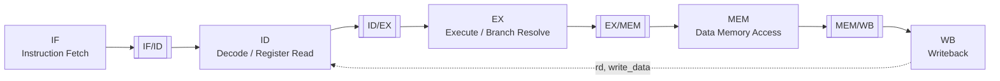
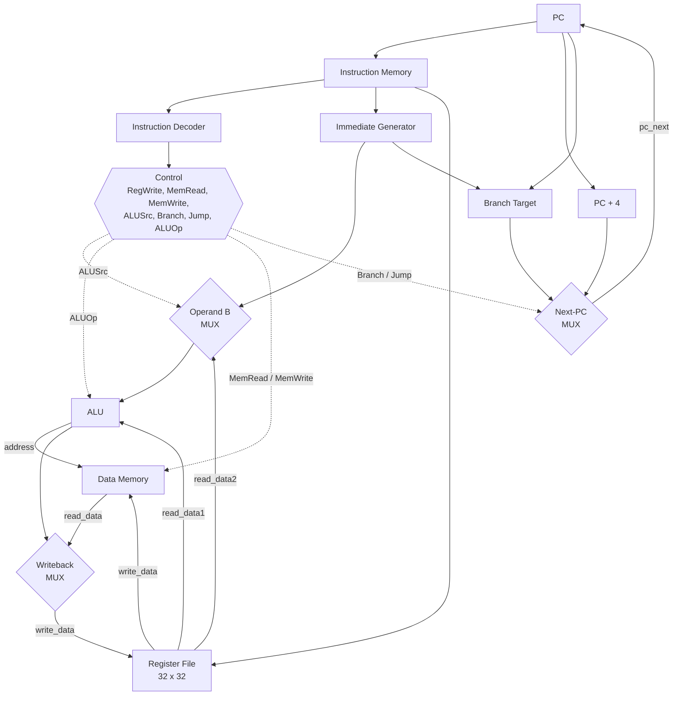
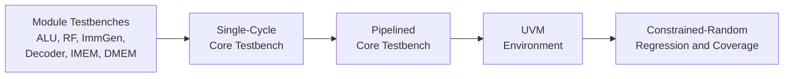
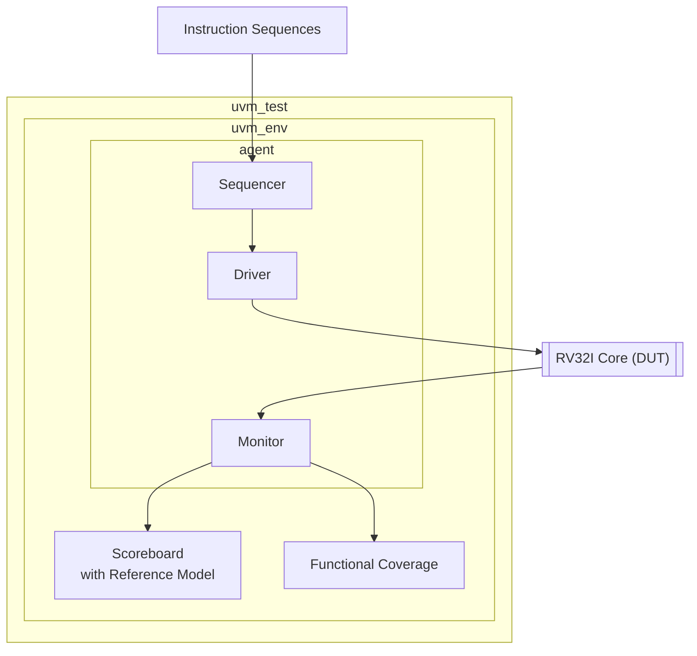
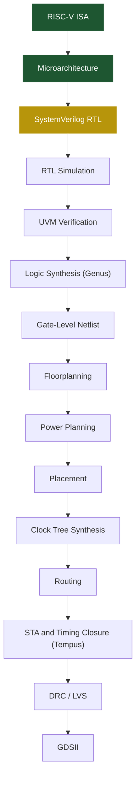

<div align="center">

# rv32_Asic_uvm

**A 32-bit RV32I RISC-V Processor: SystemVerilog RTL to GDSII**

Hand-written RTL &middot; UVM-based verification &middot; Cadence ASIC implementation flow

<br>


<br>

[Overview](#overview) &nbsp;|&nbsp;
[Status](#development-status) &nbsp;|&nbsp;
[Architecture](#architecture) &nbsp;|&nbsp;
[ISA Support](#instruction-set-support) &nbsp;|&nbsp;
[Verification](#verification-strategy) &nbsp;|&nbsp;
[ASIC Flow](#asic-implementation-flow) &nbsp;|&nbsp;
[Roadmap](#roadmap)

</div>

---

## Overview

`rv32_Asic_uvm` is a ground-up implementation of a 32-bit RISC-V processor targeting the RV32I base integer ISA. The design is developed bottom-up in SystemVerilog, first as a single-cycle core and then refined into a classic five-stage pipeline with full hazard handling.

Beyond functional RTL, the project's objective is to carry the design through a complete commercial ASIC flow:

- RTL design and module-level verification
- CPU-level verification using a UVM environment with a reference model and functional coverage
- Logic synthesis with **Cadence Genus**
- Floorplanning, placement, clock-tree synthesis and routing with **Cadence Innovus**
- Static timing analysis and timing closure with **Cadence Tempus**
- Physical verification (DRC/LVS) and GDSII generation

> [!NOTE]
> This repository is under active development. Status indicators throughout this document reflect only work that has been committed: code, testbenches, and tool reports. Sections for later stages are updated as those stages are completed.

---

## Development Status

| Stage | Status |
|---|---|
| ISA subset and microarchitecture definition | Complete |
| Core RTL blocks | Completed |
| Data memory | Complete |
| Single-cycle integration | Planned |
| Module-level testbenches | Planned |
| Five-stage pipeline | Planned |
| Forwarding and hazard detection | Planned |
| UVM verification environment | Planned |
| Logic synthesis (Genus) | Planned |
| Physical implementation (Innovus) | Planned |
| Static timing analysis (Tempus) | Planned |
| DRC / LVS / GDSII | Planned |

<details>
<summary><b>Module-level status</b></summary>

<br>

| Module | File | RTL | Testbench | Notes |
|---|---|---|---|---|
| Program Counter | `rtl/pc.sv` | Complete | Planned | Resets to `0x0000_0000`; selects `PC + 4` or branch target |
| Instruction Memory | `rtl/imem.sv` | Complete | Planned | 256 x 32-bit, indexed by `PC[31:2]`, initialized via `$readmemh` |
| Instruction Decoder | `rtl/inst_dec.sv` | Complete | Planned | Generates control signals and ALU operation select |
| Register File | `rtl/register_file.sv` | Complete | Planned | 32 x 32-bit, two read ports, one write port, `x0` hardwired to zero |
| Immediate Generator | `rtl/immgen.sv` | Partial | Planned | B-type implemented; I/S/U/J-type pending |
| ALU | `rtl/alu.sv` | Complete | Planned | Eight operations; SRA signedness under review |
| Data Memory | `rtl/dmem.sv` | In progress | Planned | Word-addressed, synchronous write |
| Writeback Multiplexer | — | Planned | Planned | Selects ALU result or load data |
| Top-Level Core | — | Planned | Planned | Single-cycle integration first |

</details>

---

## Architecture

### Target Microarchitecture: Five-Stage Pipeline



> [!IMPORTANT]
> The pipeline shown above is the target design. The core is first being integrated and verified as a single-cycle processor before being partitioned into pipeline stages.

### Single-Cycle Datapath



<details>
<summary><b>Pipeline stage responsibilities</b></summary>

<br>

| Stage | Function | Components |
|---|---|---|
| IF | Fetch instruction at `PC`; compute next PC | PC register, `PC + 4` adder, instruction memory, next-PC multiplexer |
| ID | Decode instruction fields; read source registers; generate immediate and control | Decoder, register file, immediate generator |
| EX | Perform ALU operation; evaluate branch condition; compute branch target | ALU, operand multiplexer, comparator, target adder |
| MEM | Perform load/store access | Data memory |
| WB | Write result to destination register | Writeback multiplexer, register file write port |

**Sequential PC increment.** RV32 instructions are 32 bits wide and RISC-V memory is byte-addressed; consecutive instructions are therefore separated by four addresses.

**Word indexing.** Instruction and data memories are modelled as arrays of 32-bit words. The byte address is converted to a word index by discarding the two least-significant bits, i.e. `addr[31:2]`.

</details>

<details>
<summary><b>Hazard handling (planned)</b></summary>

<br>

| Hazard | Example | Resolution |
|---|---|---|
| Read-after-write | `add x1, ...` followed by `sub x2, x1, ...` | Forwarding from EX/MEM and MEM/WB |
| Load-use | `lw x1, ...` followed by `add x2, x1, ...` | One-cycle stall inserted by hazard detection unit |
| Control | `beq`, `bne`, `jal`, `jalr` | Flush of wrong-path instructions |

</details>

---

## Instruction Set Support

The initial target is a practical subset of RV32I, to be extended toward full RV32I compliance.

| Instruction | Format | opcode | funct3 | funct7 | Decode | Datapath | Verified |
|---|:---:|:---:|:---:|:---:|:---:|:---:|:---:|
| `ADD`   | R | `0110011` | `000` | `0000000` | Yes | — | — |
| `SUB`   | R | `0110011` | `000` | `0100000` | Yes | — | — |
| `AND`   | R | `0110011` | `111` | `0000000` | Yes | — | — |
| `OR`    | R | `0110011` | `110` | `0000000` | Yes | — | — |
| `XOR`   | R | `0110011` | `100` | `0000000` | Yes | — | — |
| `SLL`   | R | `0110011` | `001` | `0000000` | Yes | — | — |
| `SRL`   | R | `0110011` | `101` | `0000000` | Yes | — | — |
| `SRA`   | R | `0110011` | `101` | `0100000` | Yes | — | — |
| `ADDI`  | I | `0010011` | `000` | — | Yes | — | — |
| `ANDI`  | I | `0010011` | `111` | — | Yes | — | — |
| `ORI`   | I | `0010011` | `110` | — | Yes | — | — |
| `XORI`  | I | `0010011` | `100` | — | Yes | — | — |
| `LW`    | I | `0000011` | `010` | — | Yes | — | — |
| `JALR`  | I | `1100111` | `000` | — | Yes | — | — |
| `SW`    | S | `0100011` | `010` | — | Yes | — | — |
| `BEQ`   | B | `1100011` | `000` | — | Yes | — | — |
| `BNE`   | B | `1100011` | `001` | — | Yes | — | — |
| `LUI`   | U | `0110111` | — | — | Yes | — | — |
| `AUIPC` | U | `0010111` | — | — | Yes | — | — |
| `JAL`   | J | `1101111` | — | — | Yes | — | — |

<details>
<summary><b>Instruction encoding formats</b></summary>

<br>

```
 31        25 24    20 19    15 14  12 11         7 6       0
+------------+--------+--------+------+------------+---------+
|   funct7   |  rs2   |  rs1   |funct3|     rd     | opcode  |  R-type
+------------+--------+--------+------+------------+---------+
|     imm[11:0]       |  rs1   |funct3|     rd     | opcode  |  I-type
+------------+--------+--------+------+------------+---------+
| imm[11:5]  |  rs2   |  rs1   |funct3|  imm[4:0]  | opcode  |  S-type
+------------+--------+--------+------+------------+---------+
|imm[12|10:5]|  rs2   |  rs1   |funct3|imm[4:1|11] | opcode  |  B-type
+------------+--------+--------+------+------------+---------+
|            imm[31:12]               |     rd     | opcode  |  U-type
+-------------------------------------+------------+---------+
|      imm[20|10:1|11|19:12]          |     rd     | opcode  |  J-type
+-------------------------------------+------------+---------+
```

**B-type immediate reconstruction** (`rtl/immgen.sv`):

```
imm[12]    = instr[31]
imm[11]    = instr[7]
imm[10:5]  = instr[30:25]
imm[4:1]   = instr[11:8]
imm[0]     = 1'b0
imm[31:13] = {19{instr[31]}}   // sign extension
```

</details>

---

## Arithmetic Logic Unit

The ALU is purely combinational. The operation is selected by a 4-bit internal encoding, `ALUOp`, generated by the decoder. This encoding is implementation-specific and not defined by the RISC-V ISA.

| ALUOp | Operation | Function |
|:---:|:---:|---|
| `0000` | ADD | `A + B` |
| `0001` | SUB | `A - B` |
| `0010` | AND | `A & B` |
| `0011` | OR  | `A \| B` |
| `0100` | XOR | `A ^ B` |
| `0101` | SLL | `A << B[4:0]` |
| `0110` | SRL | `A >> B[4:0]` (zero fill) |
| `0111` | SRA | `A >>> B[4:0]` (sign fill) |

<details>
<summary><b>Control signals</b></summary>

<br>

| Signal | Description |
|---|---|
| `RegWrite` | Register file write enable |
| `MemRead`  | Data memory read enable |
| `MemWrite` | Data memory write enable |
| `ALUSrc`   | Operand B select: `0` = `read_data2`, `1` = immediate |
| `Branch`   | Conditional branch instruction |
| `Jump`     | Unconditional jump (`JAL`, `JALR`) |
| `ALUOp`    | ALU operation select |

</details>

<details>
<summary><b>Design notes</b></summary>

<br>

- **Register `x0`.** The zero register is enforced at the ports rather than in storage: reads with `rs1` or `rs2` equal to zero return `0`, and writes with `rd` equal to zero are discarded. This avoids multiple drivers on the storage array.
- **Operand selection.** `rs2` is a 5-bit register index; the ALU operand is the 32-bit `read_data2` value from the register file.
- **Latch avoidance.** All combinational control outputs are assigned default values at the start of each `always_comb` block.
- **Arithmetic shift.** The `>>>` operator performs sign extension only when the left operand is signed; the SRA implementation is being revised accordingly.

</details>

---

## Verification Strategy

Verification is developed in parallel with the design, progressing from directed module-level tests to a constrained-random UVM environment.



<details>
<summary><b>Planned UVM architecture</b></summary>

<br>



Planned capabilities:

- Constrained-random instruction stream generation
- ISA-level reference model for result checking
- Functional coverage of opcodes, register usage, hazard scenarios and branch outcomes
- SystemVerilog assertions for protocol and invariant checking
- Automated regression

</details>

---

## ASIC Implementation Flow



<sub>Green: complete &nbsp;&middot;&nbsp; Amber: in progress &nbsp;&middot;&nbsp; Uncoloured: planned</sub>

<details>
<summary><b>Toolchain</b></summary>

<br>

| Function | Tool |
|---|---|
| Hardware description | SystemVerilog |
| Simulation | Cadence Xcelium / NC-Verilog, Verilator |
| Waveform analysis | Cadence SimVision, GTKWave |
| Verification methodology | UVM |
| Logic synthesis | Cadence Genus |
| Place and route | Cadence Innovus |
| Static timing analysis | Cadence Tempus |
| Development environment | Linux, VSCodium, Neovim |
| Version control | Git, GitHub |

</details>

---

## PPA Results

> [!NOTE]
> Synthesis and physical implementation have not yet been performed. This section will be populated with figures taken directly from Genus, Innovus and Tempus reports.

| Metric | Post-Synthesis | Post-Route |
|---|:---:|:---:|
| Technology | — | — |
| Target clock period | — | — |
| Achieved frequency | — | — |
| WNS / TNS | — | — |
| Standard-cell area | — | — |
| Cell count | — | — |
| Total power | — | — |
| DRC / LVS | — | — |

---

## Roadmap

- [x] Define ISA subset and microarchitecture
- [x] RTL: program counter, instruction memory, decoder, register file, ALU
- [x] B-type immediate generation
- [ ] Data memory
- [ ] Complete immediate generator (I, S, U, J formats)
- [ ] Writeback multiplexer
- [ ] Single-cycle core integration
- [ ] Module-level testbenches
- [ ] Single-cycle core testbench and test programs
- [ ] Pipeline registers (IF/ID, ID/EX, EX/MEM, MEM/WB)
- [ ] Forwarding unit
- [ ] Hazard detection and load-use stall logic
- [ ] Control hazard flushing
- [ ] UVM verification environment
- [ ] Logic synthesis flow (Genus)
- [ ] Physical implementation flow (Innovus)
- [ ] Static timing analysis and timing closure (Tempus)
- [ ] DRC/LVS-clean GDSII

---

## Repository Structure

```
rv32_Asic_uvm/
├── rtl/
│   ├── alu.sv              # Combinational ALU
│   ├── imem.sv             # Instruction memory
│   ├── immgen.sv           # Immediate generator
│   ├── inst_dec.sv         # Instruction decoder and control
│   ├── pc.sv               # Program counter
│   └── register_file.sv    # 32 x 32 register file
├── .gitignore
└── README.md
```

<details>
<summary><b>Planned structure</b></summary>

<br>

```
rv32_Asic_uvm/
├── rtl/          # Processor RTL
├── tb/           # Module and core testbenches
├── uvm/          # UVM verification environment
├── programs/     # Test programs (.mem)
├── syn/          # Synthesis scripts and reports
├── pnr/          # Place-and-route scripts and reports
├── sta/          # Timing analysis scripts and reports
└── docs/         # Documentation and diagrams
```

</details>

---

<div align="center">

<sub>Developed by <a href="https://github.com/AbhinavRK001">Abhinav R K</a></sub>

</div>
